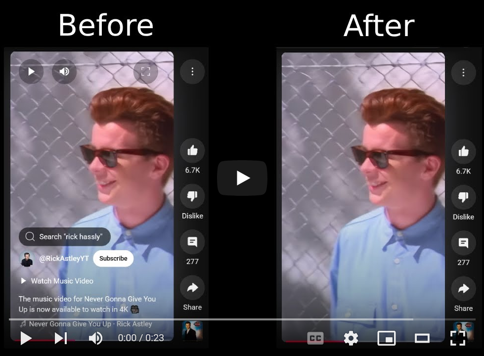

# YouTube Shorts UI Hider

A minimal browser extension that hides distracting interface elements on YouTube Shorts, until you hover over the video player.

## 🎥 Demo

  

Click the image above to watch a quick demo of the YouTube Shorts UI Hider extension in action.

## ✨ Features

- Hides the top player controls and bottom overlay (avatar, subscribe button, meta-text etc.)
- Reveals them when you move your mouse over the video
- Only activates on desktop (not on mobile)
- Lightweight

## 🧪 Local Installation for Development

You can install the extension in Chrome and Firefox without publishing it.

### 🔹 Chrome (or Chromium-based)

1. Go to `chrome://extensions`
2. Enable **Developer mode** (top right)
3. Click **Load unpacked**
4. Select the `extension/` folder inside this project

### 🔸 Firefox

1. Go to `about:debugging#/runtime/this-firefox`
2. Click **Load Temporary Add-on**
3. Select the `manifest.json` file inside the `extension/` folder.

## 🛠 Development Notes

- The script uses `MutationObserver` to attach hover listeners as YouTube loads new content
- Listeners are only attached once per video container to avoid memory issues
- The extension avoids mobile devices using a `navigator.userAgent` check

## 📃 License

MIT - free to modify, share, or remix. Have fun with it.

